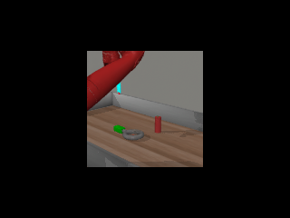
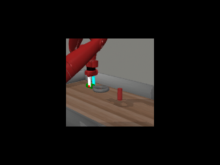

# Analyze the failures
## 1. Video Generation Lead to Failure.
### assembly-v2-goal-observable task
The generated video seems right, however, the robot has difficulty grasping the green handle.

<video width="320" height="240" controls>
  <source src="./finding/video_generation_hallucination.mp4" type="video/mp4">
</video>
<video width="320" height="240" controls>
  <source src="./finding/assembly_failure1.mp4" type="video/mp4">
</video>





Idea: The video generation only predicted 8 frames, need more fine-grained subgoals.

-> (1) Image Editing can be trained to generate a close enough subgoal in a more fine-grained manner.

-> (2) For video generation, let the gpt4 evaluate the video generation, does it contain **critical but missing frame (consistent and informative)**? For example, in this task, that's the frame the gripper touch the green handle. We can also finetune the video generation model by feeding it with data that contains the critical frame **(How to collect then?)**.

### button-press-topdown-v2-goal-observable task


## 2. Video is perfect but the robot fails to follow the video.
### assembly-v2-goal-observable task
<video width="320" height="240" controls>
  <source src="./finding/video_perfect.mp4" type="video/mp4">
</video>
<video width="320" height="240" controls>
  <source src="./finding/assembly_failure_2.mp4" type="video/mp4">
</video>

Idea: The failure comes from the robot execution problem. The inconsistency between the robot and the actual plan is a common problem, even for other works like instruction following agents. 

We should 
- (1) detect the discrepancy (**How?**). 
- (2) image editing correcting effectively (**How?**). 
- (3) regenerate video again 
- (4) gpt4 evaluate whether there are critical but missing frame

### button-press-topdown-v2-goal-observable task
<video width="320" height="240" controls>
  <source src="./finding/button_topdown_video_perfect1.mp4" type="video/mp4">
</video>
<video width="320" height="240" controls>
  <source src="./finding/buton_topdown_failure1.mp4" type="video/mp4">
</video>

Can the original model corrects itself effectively? Let's see the VCR.

<video width="320" height="240" controls>
  <source src="./finding/button_topdown_correct_pred.mp4" type="video/mp4">
</video>
<video width="320" height="240" controls>
  <source src="./finding/button_topdown_correct_actual.mp4" type="video/mp4">
</video>

The video generated is correct, though the gripper suddenly jumps up. However, the model is actually only focusing on the button mask and calculate transforms to get close to the button. The failure of correction is because the gripper doesn't correct itself immediately and effectively after failing pressing the button and drop heavily down as shown in the previous video, due to the serious occlusion and the difficult positions, the model can't recover. 

This shows the importance of detecting failures and timely & effectively recovering.


# Our Method
## Metaworld Environment
### Video Generation Evaluation by GPT-4V
Observation: The generated video are actually align with oracle policy. Because the metaworld manipulation task are actually simple, and doesn't involve complex dynamics and reasoning, the failure due to video generation problem mainly about inconsistency. Therefore we don't need to let the GPT-4V do complex reasoning at this step, for example, "you should instead move your gripper to .....". (The generated videos all know where to reach)

Prompt GPT-4V for evaluating whether the generated video has critical but inconsistently missing frames. If there are, the video generation model will replan.


### Data Collection for Video Generation Model Finetuning and Image Editing Training
**Important Challenge**

How to generate an effective image editing as subgoal?
How to identify critical frame during video generation and image editing?

**Question in Mind**

The optical flow is masked by the operated object, i.e. the model is tracking the motion of the manipulated objects, not the gripper itself, therefore it makes no sense just letting the gripper move along a reasonable trajectory. What's really critical is the interaction between the gripper and the object.

**We have the solution!**

Note that the oracle video generation data and image editing data used for training that we will use are generated by the oracle policy.
We have access to the oracle policy, and checking the code we can find that they have predefined oracle important subgoals.

We just need some minor engineering (<20 lines of code), so that when we run the oracle policy, we can identify the critical frame.

Below is an example of oracle policy. It's just used for generating training and finetuning data, and they are not accessible during inference time.
```py
def _desired_pos(o_d):
        pos_curr = o_d['hand_pos']
        pos_wrench = o_d['wrench_pos'] + np.array([-.02, .0, .0])
        pos_peg = o_d['peg_pos'] + np.array([.12, .0, .14])

        # If XY error is greater than 0.02, place end effector above the wrench
        if np.linalg.norm(pos_curr[:2] - pos_wrench[:2]) > 0.02:
            return pos_wrench + np.array([0., 0., 0.1])
        # (For later) if lined up with peg, drop down on top of it
        elif np.linalg.norm(pos_curr[:2] - pos_peg[:2]) <= 0.02:
            return pos_peg + np.array([.0, .0, -.2])
        # Once XY error is low enough, drop end effector down on top of wrench
        elif abs(pos_curr[2] - pos_wrench[2]) > 0.05:
            return pos_wrench + np.array([0., 0., 0.03])
        # If not at the same Z height as the goal, move up to that plane
        elif abs(pos_curr[2] - pos_peg[2]) > 0.04:
            return np.array([pos_curr[0], pos_curr[1], pos_peg[2]])
        # If XY error is greater than 0.02, place end effector above the peg
        else:
            return pos_peg
```

**Data Collection for Video Generation Finetuning**

I have collected many trajectories. Even for successful trajectories, many of them involve several times of replanning. If there are 5 replans in one trajectory for example, then we can make use of it as 5 sub-trajectories.

Those are steps that are prone to failure, so I set initial images from those replanning steps, and run expert policy planner from there, and identify several important subgoals. Fix those important critical frames, we sample other frames until we have 8 frames altogether.

As for the language conditioning, actually we realize that simply condition on the task name is enough (for this manipulation task). **Note that we don't need any prompting at this stage. Therefore, the data collection is efficient.**


**Date Collection for Image Editing Training**

The data collection contains 2 parts. 
- (i) We use the collected AVDC trajectories, identifying those steps around the replanning steps, and from those steps we wrong the expert trajectory, until the next critical subgoal. We select the initial frame and the final frame as training data. Setting the language condition to be the task name is enough.
- (ii) Besides the collected limited AVDC trajectories, we can also run unlimited expert trajectories, and sample initial frames, and identify the closed important subgoal frame to be the supervised result image.

### Identify the failure?

**The method shouldn't be off the track to solving the common failure scenario: The predicted video is perfected, but the gripper doesn't successfully grasp the object, and doesn't notice, and lead to serious irrecoverable failure.**

**Ideal Case: Immediately notice that the grasp is not precise and is deviated, and actively appealing to image editing to correct and replan.**

**Important! What we have!**
We have calculated self.subgoals. There are 8 calculated subgoals based on the 8 predicted frames.
```py
def _desired_pos(self, o_d):
        pos_curr = o_d['hand_pos']
        move_precision = 0.12 if self.mode == "push" else 0.04

        # if stucked/stopped(all subgoals reached), replan
        if self.replan_countdown <= 0 and self.replans > 0:
            grasp, transforms = self.calculate_next_plan()
            self.plan_steps.append(self.step)
            self.grasp = grasp[0]
            self.subgoals = self.calc_subgoals(grasp[0], transforms)
            if self.mode == "push": self.init_grasp()
            return self.subgoals[0]
        # place end effector above object
        elif not self.grasped and np.linalg.norm(pos_curr[:2] - self.grasp[:2]) > 0.02:
            return self.grasp + np.array([0., 0., 0.2])
        # drop end effector down on top of object
        elif not self.grasped and np.linalg.norm(pos_curr[2] - self.grasp[2]) > 0.04:
            return self.grasp
        # grab object (if in grasp mode)
        elif not self.grasped and np.linalg.norm(pos_curr[2] - self.grasp[2]) <= 0.04:
            self.grasped = True
            return self.grasp
        # move end effector to the current subgoal
        elif np.linalg.norm(pos_curr - self.subgoals[0]) > move_precision:
            return self.subgoals[0]
        # if close enough to the current subgoal, move to the next subgoal
        elif len(self.subgoals) > 1:
            self.subgoals.pop(0)
            return self.subgoals[0]
        # move to the last subgoal
        # ideally the gripper will stop at the last subgoal and the countdown will run out quickly
        # and then the next plan (next set of subgoals) will be calculated
        else:
            return self.subgoals[0]
```

The above self.subgoals mean that we can align the video frames with actual video frames for easier comparison, that's important!

**If we prompt GPT-4V or VideoLLaVA every time we reach another subgoal, will it be too expensive and wasting time? However, prompting GPT-4V or VideoLLaVA is critical because the replanning opportunity is limited, and we need to be cautious.**

I think the detection of failure involves two types.

(1) Type 1. Just finish a subgoal, but it is deviated. We wish to check up till now, whether it is on the right track? For example, just finished reaching subgoal 5. We have predicted and actual frames 0~4. We can compare by contrastive learning (**Or simply prompt every time?**)

- Idea: **Contrastive Learning**. Train a net to judge whether the actual video aligns with the predicted plan video using contrastive learning, the net will predict a logit, and if it is smaller than a threshold, we will send the **two videos of same number of frames** to the VideoLLaVA or GPT-4V to check whether we should replan and correct immediately.

**Challenge**: Is it easy to train the net to support varying input length? How should we generate the positive and negative data pairs? 


(2) Type 2. Not reaching the next subgoal. For example, have finished subgoal 0~5, and checked that they are OK. But the agent can't reach the next subgoal, for example, successfully grasp the object. **In the original paper, only replan when the agent stops for too long. Just like the figure I shown before, the robot may spend too long time deviating and not reaching the next subgoal, and finally it's too far from recoverable.**
- Idea : **Heuristic**. Train a net, that given two frames, estimate the time steps needed (inspired by video language planning) to get from the first frame to the second frame. Then check the potential discrepancy and replan timely. This time we just need to prompt the actual videos after the last achieved subgoal, and the **two predicted frame (last achieved and the one still not achieved)** and ask whether it needs timely correction. We can continue to iterate on, heuristic prediction and prompt until (1) replanning (2) iterate steps reach a bound.

****

**Challenge**: Can train, not hard to collect data, but wait to see the performance.


